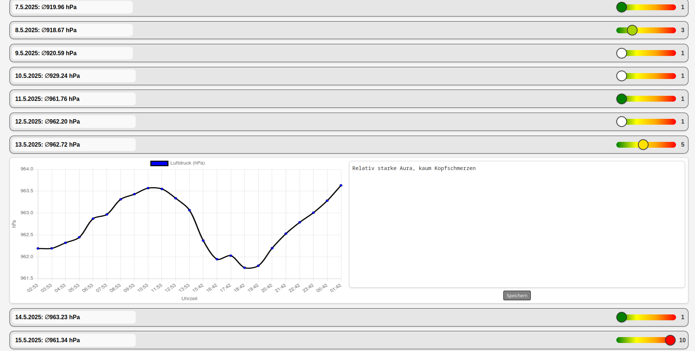

# Luftdrucktracker

## Abstract
Der Luftdrucktracker erfasst stündlich barometrische Daten über einen BMP280-Sensor am Raspberry Pi und speichert diese in einer SQLite-Datenbank. Zusätzlich können Migräneereignisse mit Notizen und Intensitäten erfasst und über eine Weboberfläche visualisiert werden. Eine lokale API stellt die Daten bereit und ermöglicht das Erfassen sowie Aktualisieren von Einträgen.

## Beschreibung
Der Luftdrucktracker verwendet einen BMP280-Sensor, der an einem Raspberry Pi per i2c angeschlossen ist, um stündlich Luftdruckdaten in einer SQLite-Datenbank zu speichern. Die Datenbankd beinhaltet zwei Tabellen. Eine für die Luftdruckdaten "pressure_readings" und eine für Migräneevents "migraine_events". Diese Daten werden anschließend auf dem Frontend grafisch dargestellt. Bei Migräneereignissen können Notizen und Intensitäten für den jeweiligen Tag eingetragen werden. Diese Informationen werden auf die API gepostet und bei einem Neuladen der Seite wieder von der API abgerufen und angezeigt. Migräneeinträge werden je nach Intensität farblich hervorgehoben. Es werden keine Duplikate geschrieben, sondern wenn z.B. die Notiz am tag bearbeitet wird, wird der Datenbankeintrag erneuert.




## Out of scope
Die API wird lokal auf dem Raspberry gehostet und läuft auf dem Port 3000. Dieser wird über einen HAProxy veröffentlicht. Die Verschlüsselung übernimt acme.sh welches automatisch Zertifikate generiert. Das Frontend wird per lokalem nginx auf dem raspberry pi, Port 80, intern veröffentlicht. Dies wird ebenfalls via HAProxy und acme.sh ins Internet publiziert.

## Endpoints

### `/api/pressure/history`

**GET:**  
Gibt alle gesammelten barometrischen Daten aus der SQLite-Datenbank zurück.

```json
{"pressures":[
    {"timestamp":"2025-05-13T11:53:07.913Z","pressure":963.0665906429475},
    {"timestamp":"2025-05-13T13:42:26.131Z","pressure":962.3733457813566}
]}
```

### `/api/migraine`

**GET:**  
Gibt alle Migräneereignisse mit Notizen und Intensitäten zurück.

```json
[
    {"timestamp":"2025-05-08","severity":3,"note":"Leichte Migräne"},
    {"timestamp":"2025-05-13","severity":5,"note":"Relativ starke Aura, kaum Kopfschmerzen"}
]
```

**POST:**  
Erstellt ein neues Migräneereignis mit Notiz und Intensität.

## Funktionsweise des Clients
Es wird für jeden Tag im Monat, von welchem Luftdruckdaten vorhanden sind, einen Listeneintrag erstellt. Links steht der durchschnittliche Luftdruck von diesem Tag. Durch Klick auf den Tag (Eintrag) wird ein Bereich aufgeklapt. In diesem Bereich wird zum einen der Lufdruckverlauf angezeigt, zum anderen kann eine Notiz angelegt werden. Zusätzlich kann bei jedem Tag der Slider-Wert gesetzt werden. Dieser sagt aus, wie stark die Migräne an diesem Tag war. Ungesetzte Slider haben den Wert 1 und sind weiss. Um die Slider-Werte sowie die optionale Notiz zu speichern, muss noch der entsprechende Button geklickt werden. Beim nächsten Aufruf der Seite werden nun die gesetzten Slider und Notizen angezeigt und man kann so die Einträge vergleichen. Daraus soll sich ein etwaiges Muster erkennen lassen, ob die Migräne einen Zusammenhang mit dem Luftdruck hat.

## Inbetriebnahme

### Voraussetzungen

Installieren Sie die folgenden Pakete aus den Standard-Repositories:

```bash
apt install yarn node git
```

### Projekt klonen

Klonen Sie das Projekt in den Ordner `/opt/`:

```bash
git clone [git-url] /opt/Luftdrucktracker
```

### Abhängigkeiten installieren

Navigieren Sie in den Ordner `API` des geklonten Projekts und installieren Sie die JavaScript-Abhängigkeiten:

```bash
cd /opt/Luftdrucktracker/API
yarn install
```

### Server starten

Starten Sie den Server manuell, um zu überprüfen, ob alles funktioniert:

```bash
node server.js
```

### Systemdienst einrichten

Kopieren Sie die Datei `luftdrucktracker.service` aus dem Ordner `system_files` nach `/etc/systemd/system/` und aktivieren Sie den Dienst:

```bash
cp /opt/Luftdrucktracker/system_files/luftdrucktracker.service /etc/systemd/system/
systemctl enable luftdrucktracker.service
systemctl start luftdrucktracker.service
```

### Zugriff

Die Endpoints sind über die URL des Raspberry Pi und Port 3000 erreichbar.

